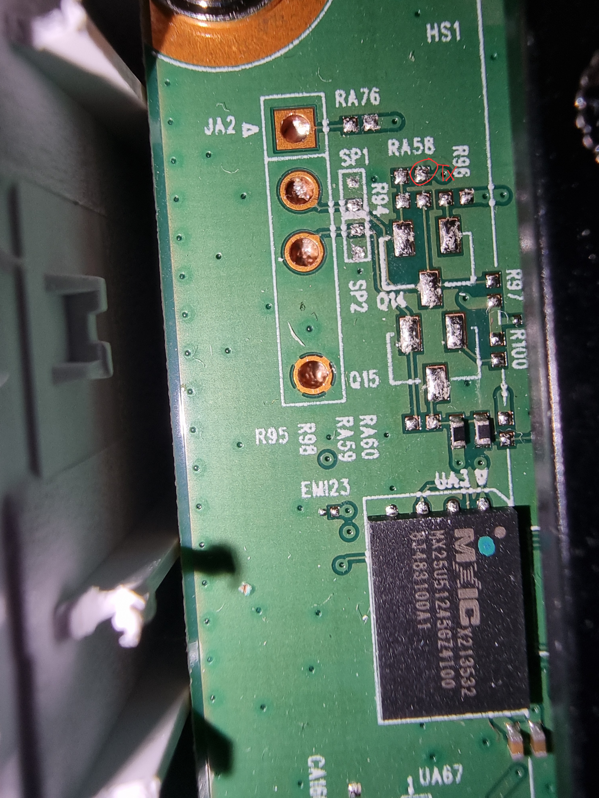

# Getting UART access

So far ive identified what looks like a UART interface. Baudrate appears to be 115200 bps 

The pins are not connected to the interface, but after probing around a bit, i saw the actual TX pin 

Here's the current pinout of the big UART pad (JA2)
|Pin number from top|How to connect the pads to the UART pad|
|---|---|
|+3.3V|Bridge the resistor pads RA76|
|TX|Bridge the top pad of RA50 marked on the photo to the pad right under it|
|RX??|??|
|GND|Already connected|

The current task is to bridge those pads and get a proper connection, but in the meanwhile, here's a console dump i managed to get by just holding the RX pin of my arduino to the TX pad

[Console dump](./Console_dump_11.05.2024.txt)

Ive been looking for the RX  pad to no avail. I did see in the logs that TX is GPIO pin 9 and RX is GPIO pin 1, but have no idea how to even look for those on the PCB
Here's the color scheme for the markings on the picture:
|Color|Function|
|---|---|
|Red|Connection pads for TX|
|Purple|Checked pads. No RX|
|Light blue|Ground pads|

Here's the full board picture without the heatsink. (zoom in. It's 100MP)

