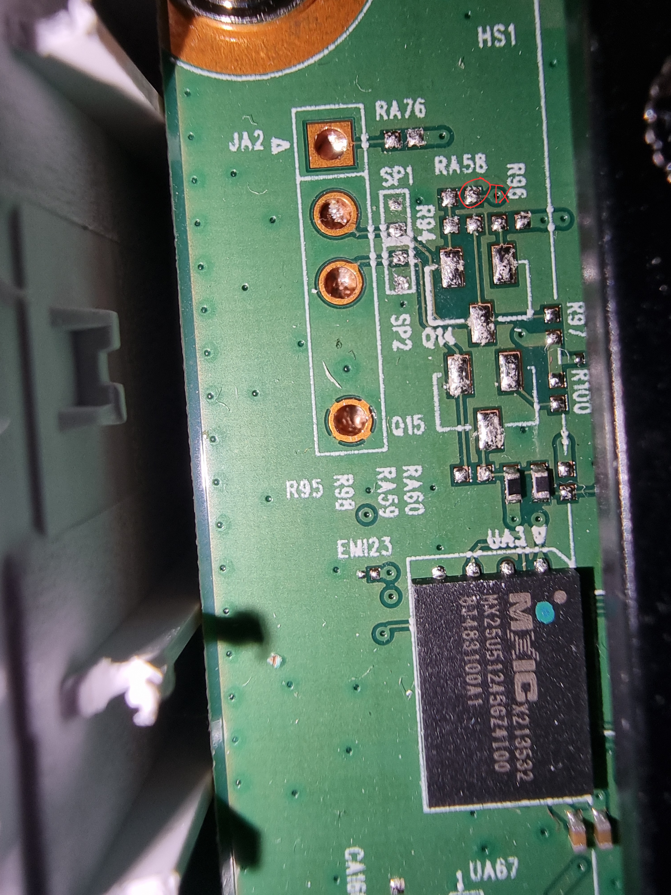

# Getting UART access

So far ive identified what looks like a UART interface. Baudrate appears to be 115200 bps 
The pins are not connected to the interface, but after probing around a bit, i saw the actual TX pin 

Here's the current pinout of the big UART pad (JA2)
|Pin number from top|How to connect the pads to the UART pad|
|---|---|
|+3.3V|Bridge the resistor pads RA76|
|TX|Bridge the top pad of RA50 marked on the photo to the pad right under it|
|RX??|??|
|GND|Already connected|

The current task is to bridge those pads and get a proper connection, but in the meanwhile, here's a console dump i managed to get by just holding the RX pin of my arduino to the TX pad
[Console dump](./Console_dump_11.05.2024.txt)

